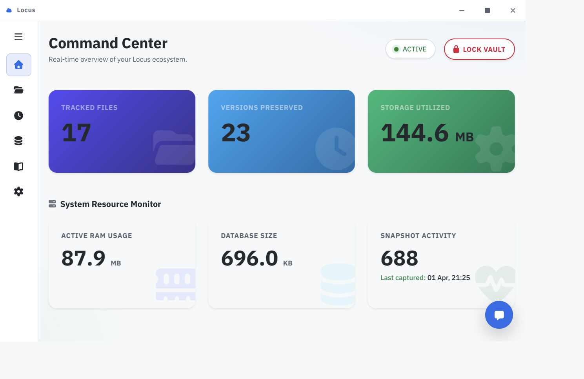
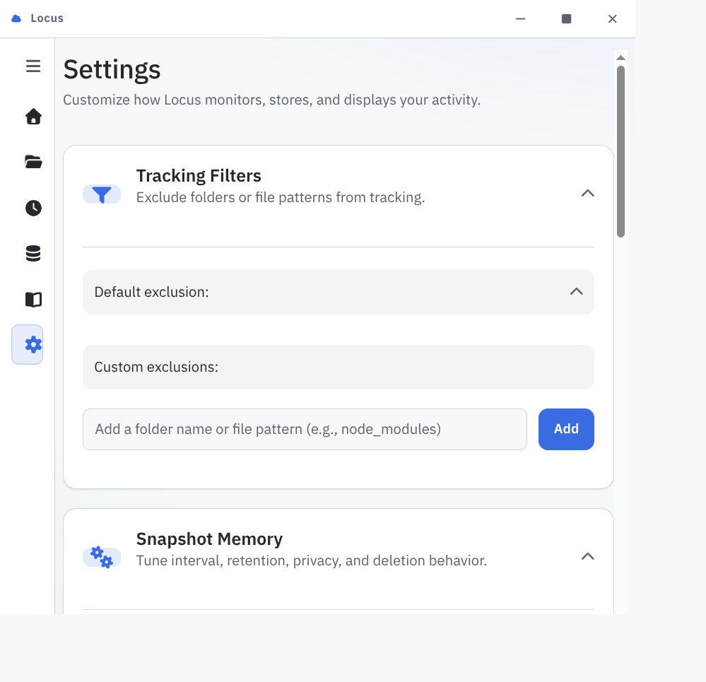
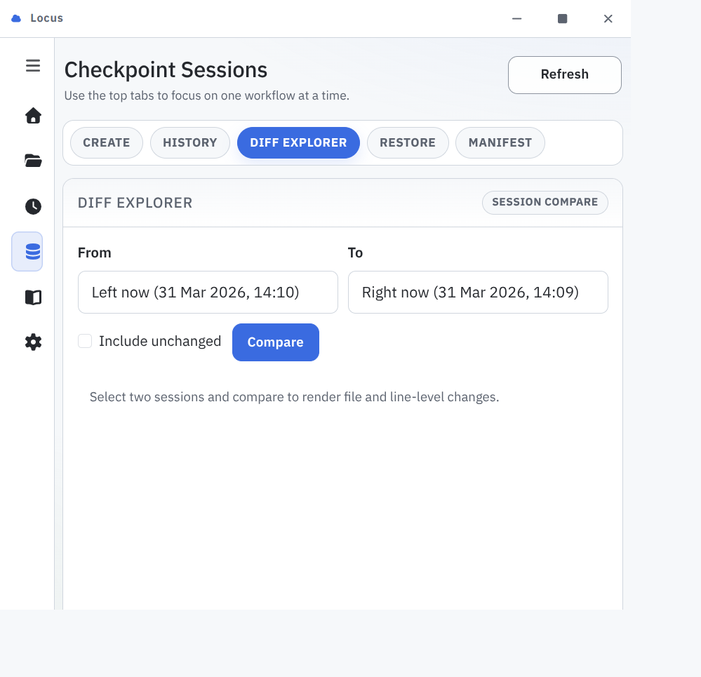
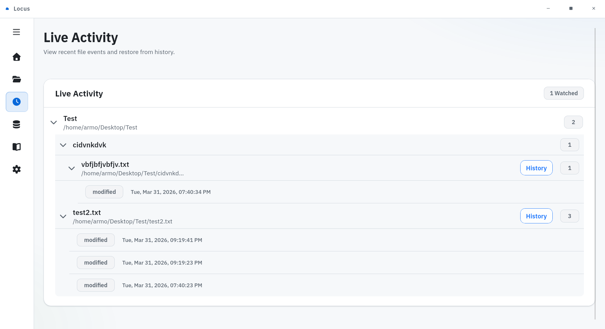
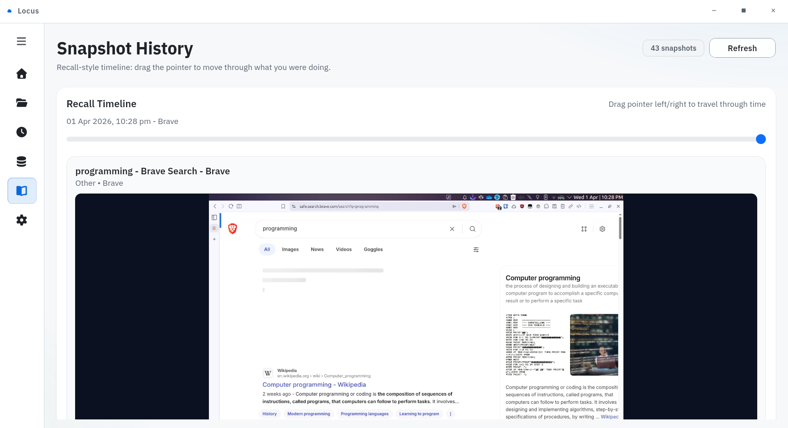

# Locus

Locus is a local-first desktop memory and activity intelligence tool.
It helps you track file evolution, capture work context, and recover historical state without sending your data to a cloud service.

## Why this project exists

For most of the dev's inlcuding me who are not so into git and github and work solo

- You did something important but forgot how you did it.
- You need to restore a previous state of a file or entire project but don't want to get involved with git and other versioning systems.
- You want timeline-style memory of your desktop work, but with local control.

Locus addresses this by combining file monitoring, snapshot memory, and checkpoint-based restore in one desktop app.

## What Locus does

- Watches selected folders and tracks file changes over time.
- Preserves file versions for rollback and history inspection.
- Captures active-window snapshots for timeline recall. (Mimics Windows 11's Recall feature with privacy first approach)
- Supports checkpoint sessions with diff and restore workflows.
- Includes lock screen authentication and recovery-key setup.
- Runs in tray/background mode for continuous tracking.
- Provides Linux and Windows service scripts for backend persistence.

## Screenshots

Dashboard



Settings



Checkpoint Sessions



Live Activity



Snapshot History



## Core architecture

- Desktop shell: Tauri (Rust)
- UI: Svelte + Vite
- Backend API: FastAPI (Python)
- Storage: SQLite

This split keeps the backend reusable and independent from the UI runtime.

## Privacy

Locus is designed to keep core activity and file history data on your local machine and keeping these safe with your master password and recovery password so that no one else can have access to your activities.

## Caution

Try to store your master password and recovery password in a safe place otherwise there's no way to recover Locus's data at all, one has to redo everything from beginning.

## Development setup

### Prerequisites

- Python 3.11+ (project currently tested with 3.13 in CI)
- Node.js 20+
- Rust stable toolchain
- Cargo Tauri CLI

Linux desktop build dependencies:

- libwebkit2gtk-4.0-dev
- libgtk-3-dev
- libayatana-appindicator3-dev
- librsvg2-dev
- patchelf

### Run in development

Backend (from repo root):

```bash
python -m venv .venv
source .venv/bin/activate
pip install -r backend/requirements.txt
cd backend
uvicorn app.main:app --reload
```

UI (new terminal, from repo root):

```bash
npm --prefix ui install
npm --prefix ui run dev
```

Optional Tauri desktop shell (new terminal, from repo root):

```bash
env PATH="$HOME/.cargo/bin:$PATH" \
	PKG_CONFIG_PATH="$PWD/src-tauri/pkgconfig-compat:$PKG_CONFIG_PATH" \
	LIBRARY_PATH="$PWD/src-tauri/lib-compat:$LIBRARY_PATH" \
	LD_LIBRARY_PATH="$PWD/src-tauri/lib-compat:$LD_LIBRARY_PATH" \
	RUSTFLAGS="-L native=$PWD/src-tauri/lib-compat $RUSTFLAGS" \
	cargo tauri dev
```

```powershell
cd C:\path\to\LOCUS
python -m venv .venv
.\.venv\Scripts\Activate.ps1
pip install -r backend\requirements.txt
npm --prefix ui install
cargo tauri build --target x86_64-pc-windows-msvc
```

Use this when you need real installer/runtime checks (tray behavior, auth persistence, popup UX, packaging).

### About Wine

Wine can be used for quick smoke tests, but it is not reliable for final Tauri + system integration validation.
Prefer VM or GitHub Windows runners for release confidence.

## Service mode

### Linux user service

Install and start backend service:

```bash
chmod +x scripts/services/install-linux-user-service.sh
./scripts/services/install-linux-user-service.sh
```

Verify:

```bash
systemctl --user status locus-backend.service
journalctl --user -u locus-backend.service -f
```

Remove:

```bash
chmod +x scripts/services/uninstall-linux-user-service.sh
./scripts/services/uninstall-linux-user-service.sh
```

### Windows service

From elevated PowerShell:

```powershell
powershell -ExecutionPolicy Bypass -File .\scripts\services\install-windows-service.ps1
sc.exe query LocusBackend
```

Remove:

```powershell
powershell -ExecutionPolicy Bypass -File .\scripts\services\uninstall-windows-service.ps1
```

## Troubleshooting

Runtime settings and health:

```bash
curl -sS http://127.0.0.1:8000/settings/runtime
curl -sS http://127.0.0.1:8000/health
```

Linux app-name detection checks:

```bash
command -v locus-window-probe || true
command -v kdotool || true
command -v xdotool || true
command -v xprop || true
echo "DISPLAY=$DISPLAY"
echo "XDG_SESSION_TYPE=$XDG_SESSION_TYPE"
```

If snapshots show Unknown app names, Locus will try providers in this order:

1. bundled locus-window-probe
2. kdotool
3. xdotool
4. xprop